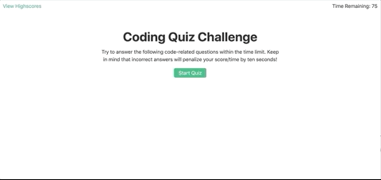

# README-Generator
[Link to Repo](https://github.com/jpreston-alt/README-Generator) 


## Description
Generates a readme based on user input
## Table of Contents
* [Usage](#usage)
* [Technologies](#technologies)
* [Questions](#questions)
* [Installation](#Installation)
* [Contributing](#Contributing)
* [Tests](#Tests)
* [License](#License)

## Usage
answer prompted questions


## Technologies
* JavaScript
* Node.js
* Axios


## Installation
To install necessary dependencies, run the following command: 
``` 
npm install 
``` 


## License
This project is licensed under the MIT license.

## Contributing
Hit me up

## Tests
To run tests, run the following command: 
``` 
npm test 
```


## Questions
​
If you have any questions about the repo, open an issue or contact me:

On GitHub: [jpreston-alt](https://github.com/jpreston-alt) | Via Email: joannappreston@gmail.com

