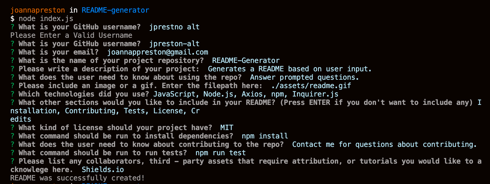

# [README-Generator](https://github.com/jpreston-alt/README-Generator)


## Description
A well crafted README is essential to any project, but we all know we’d rather spend more time improving our projects themselves, and less time fussing with our README’s. This application streamlines the README writing process by providing the user with a command line interface application that generates a quality README (like this one!) simply by answering the prompted questions.

The user is first prompted to answer questions about their project that are essential to any README. Since not all projects require the same kind of README, the user is then given a choice of other sections they would like to include based on the need of their project. Optional sections include: License, Installation, Credits, Contribution, and Tests. Based on this answer, they are then prompted with follow up questions. After the last question is answered, their README.md file is generated and they can add it to their project repository.

Building this program taught me so much about working with server-side JavaScript in Node.js. I got comfortable creating and working with modules, and can definitely see the benefit of breaking your code up into smaller, more manageable pieces. This project also taught me about the wonderful world of node package manager and how to utilizing it’s different modules. This program primarily uses inquirer for prompting users on the command line, and axios for requesting information from GitHubs' API about the user. Since this program relies so heavily on requested information (both from the user and from GitHub's API), it forced me to learn a lot about asynchronous programing and working with callbacks and promises.

## Table of Contents
* [Usage](#usage)
* [Technologies](#technologies)
* [Questions](#questions)
* [Installation](#Installation)
* [License](#License)
* [Credits](#Credits)


## Usage
1. From your terminal navigate to your README-Generator directory.
1. If dependencies are not already installed, do so now.
1. Run node.js on the command line to get started.
1. Enter your GitHub user name (must enter a valid username to continue).
1. Answer the following prompted questions about your project.
1. Make sure you enter a valid repository name in order for badges and links to work.
1. Choose between optional sections to add (License, Tests, Contributions, Installation, Credits).
1. Answer the follow up questions based on your selection.
1. README will be generated and success message will appear.
1. Preview and make small changes in markdown as needed.
1. Add your shiny new README to your project repository!

## Prompted Questions Include: 


## Finished Product

View a full video of the application [here](https://drive.google.com/file/d/1M2ox4P1jRqctpaC0oQT-gg4Gknww8ZRW/view).

This README that you are reading right now was generated with README-Generator. For an example that includes all required and optional sections [click here](./example/generated-README.md).


## Technologies
* JavaScript
* Node.js
* Axios
* npm
* Inquirer.js


## Installation
To install necessary dependencies, run the following command: 
``` 
npm install 
``` 


## License
This project is licensed under the MIT license.

## Credits
* [Shields.io](https://github.com/badges/shields)
* [Inquirer.js](https://www.npmjs.com/package/inquirer)
* [Axios](https://github.com/axios/axios)


## Questions
If you have any questions about the repo, please contact me:

On GitHub: [jpreston-alt](https://github.com/jpreston-alt) | Via Email: joannappreston@gmail.com

